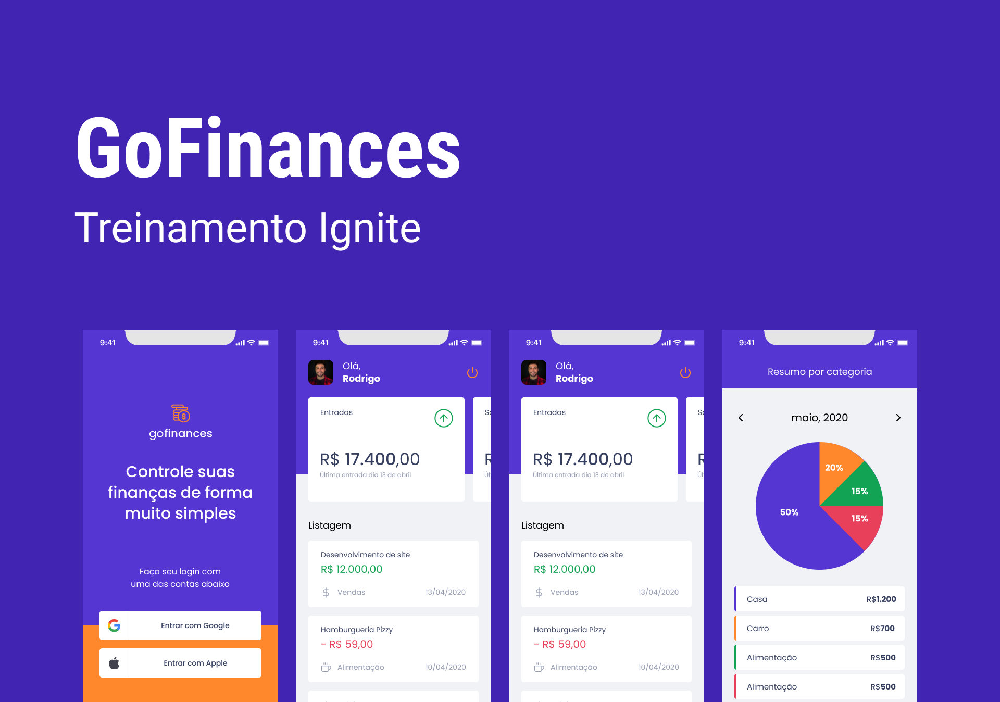

<h1 align="center">
  Gofinances
</h1>

<p align="center">	
  <a href="https://www.linkedin.com/in/diegoventurasg/">
      
  </a>
  
  
  <a href="https://github.com/diegoventura/gofinances/commits/master">
    
  </a>
  
</p>

## 📖 Sobre

O Gofinance é um projeto que foi desenvolvido durante o Ignite da Rockeseat. Ele é um aplicativo de finanças pessoais com o objetivo de ajudar as pessoas a organinizarem suas vidas financeiras. 

## 🎨 Layout



## 🚀 Tecnologias

- React Native
- Typescript
- Expo
- Styled Components
- AsyncStorage
- React Navigation
- React Hook Form
- Login Social (Google e Apple)


## 🔧 Executando o projeto

Utilize o **yarn install** ou o **npm install** para instalar as dependências do projeto.
Em seguida, inicie o projeto.

```cl
expo start
```

Lembre-se de criar o seu projeto no Google Cloud Platform para obter as credencias de autenticação. Em seguida, defina no arquivo .env as configurações do seu App (remova o example do arquivo .env.example).
 
 ```cl
CLIENT_ID=
REDIRECT_URI=
```

##

Esse projeto foi desenvolvido por **[@Diego Ventura](https://www.linkedin.com/in/diegoventurasg/)**